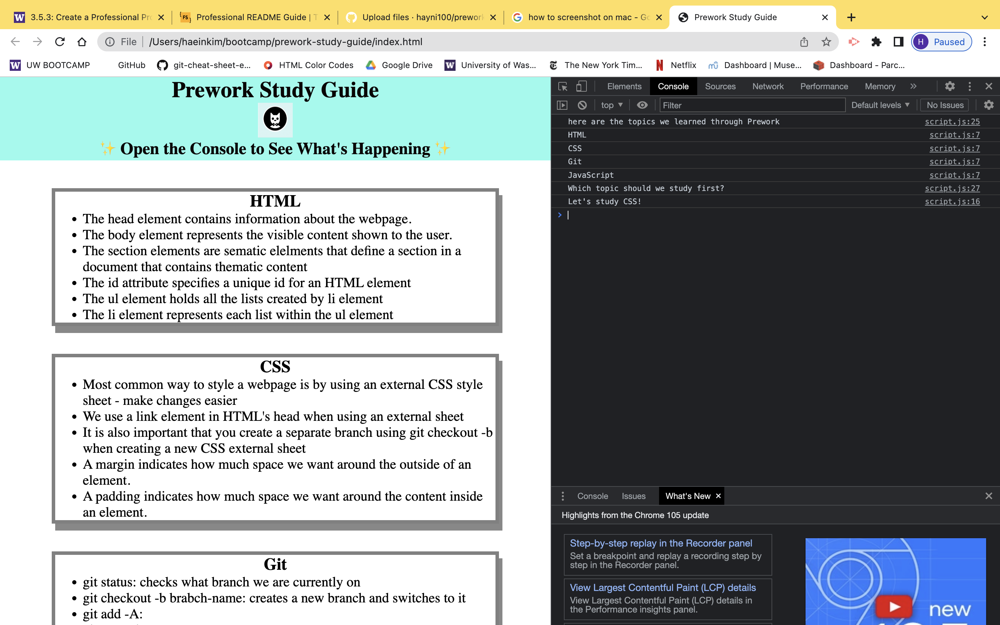

# Prework Study Guide Webpage
## Description

- What was your motivation? To better understand the new materials for basic web developing skills 
- Why did you build this project? To organize materials learned from the coding bootcamp prework course
- What problem does it solve? Creates a memory bank for my poor brain
- What did you learn? I learned how to run basic web developing programs such as HTML, CSS, JavaScript, and Git

## Table of Contents (Optional)

If your README is long, add a table of contents to make it easy for users to find what they need.

- [Installation](#installation)
- [Usage](#usage)
- [Credits](#credits)
- [License](#license)

## Installation

For starters, I used HTML to insert necessary contents for the web page. This includes title, subtitle, header, footer, and main contents of the webpage which is about HTML, CSS, Git, and Java script. Then, I used CSS to put them into structure. I made boarders and boundaries around the header and footer as well as arounnd each of the main contents. Next, I used JavaScript to create interactive interface that works on Chrome DevTools. I coded the program to have random subjects (HTML, CSS, Git, JavaScript) to pop up in consol under "what should we study today?". 

## Usage
Use command+option+i on mac and control+shift+i on windows to open DevTools on Chrome to see text under consol.

## Credits
- N/A

## License
MIT License

Copyright (c) [2022] [Haein Kim]

Permission is hereby granted, free of charge, to any person obtaining a copy
of this software and associated documentation files (the "Software"), to deal
in the Software without restriction, including without limitation the rights
to use, copy, modify, merge, publish, distribute, sublicense, and/or sell
copies of the Software, and to permit persons to whom the Software is
furnished to do so, subject to the following conditions:

The above copyright notice and this permission notice shall be included in all
copies or substantial portions of the Software.

THE SOFTWARE IS PROVIDED "AS IS", WITHOUT WARRANTY OF ANY KIND, EXPRESS OR
IMPLIED, INCLUDING BUT NOT LIMITED TO THE WARRANTIES OF MERCHANTABILITY,
FITNESS FOR A PARTICULAR PURPOSE AND NONINFRINGEMENT. IN NO EVENT SHALL THE
AUTHORS OR COPYRIGHT HOLDERS BE LIABLE FOR ANY CLAIM, DAMAGES OR OTHER
LIABILITY, WHETHER IN AN ACTION OF CONTRACT, TORT OR OTHERWISE, ARISING FROM,
OUT OF OR IN CONNECTION WITH THE SOFTWARE OR THE USE OR OTHER DEALINGS IN THE
SOFTWARE.

